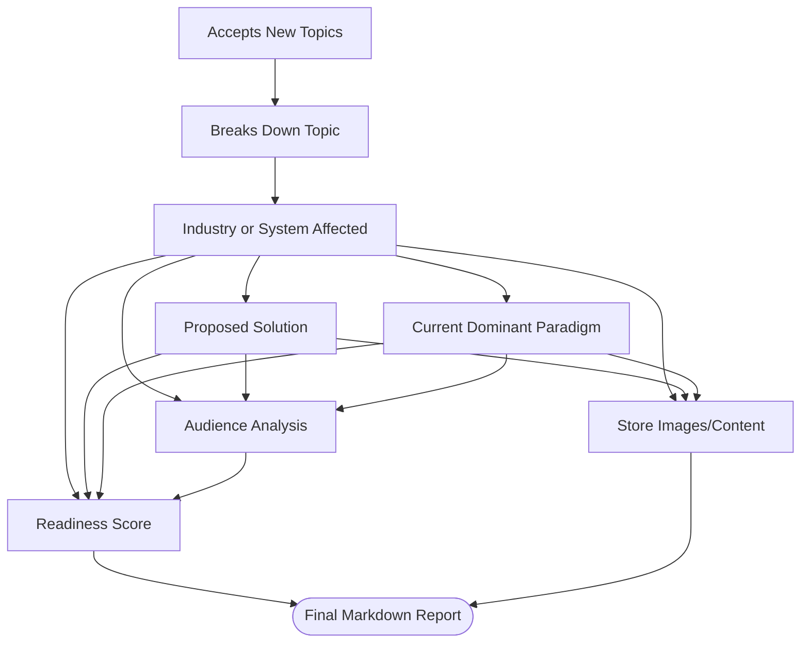
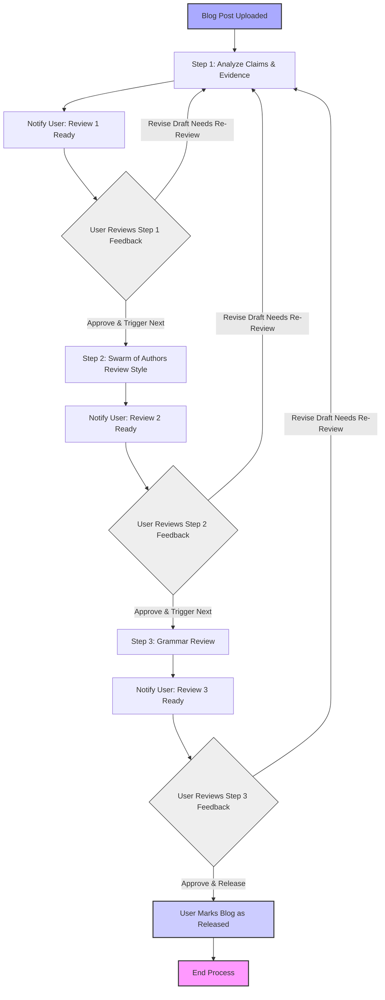

# blog-accelerator-agent
Tools for accelerating research and review of thoughtful blog posts. No plans for AI written features as I believe it is critical for comprehension and nuance that a human write the piece.

## Researcher Features

 - [ ] Accepts New Topics into blog post queue // In the long term, this will be a webhook from a new notion page, that automatically adds new topics to the queue.
    - [ ] Topic shall have a clear opinion, a clear audience and a clear industry or system that would be affected by the opinion
    - [ ] Topic should be timely and relevant
    - [ ] Topic should be unique and not easily found elsewhere
- [ ] Breaks down the topic into a list of subtopics and questions
    - [ ] Industry or system affected
    - [ ] Proposed solution
    - [ ] Current dominant paradigm
    - [ ] Audience
- [ ] Researches the subtopics and questions and creates a markdown report, with the name of the topic. containing all the information outlined below, all images and sources for future review.
- [ ] Industry or system affected
    - [ ] Determines the critical challenges facing the industry or system in relation to the proposed solution. It then dives into those challenges to understand the core components that make them challenging, risky, slow, expensive or inefficient.
    - [ ] Uses authoritative sources for each observation, it logs these sources for later reference. It should not use sources that have been black listed.
- [ ] Proposed solution
    - [ ] It looks for 5 - 10 ways the proposed solution can address each of the critical challenges facing the industry or system. It creates compelling arguments for each reason. It then outlines the things that need to be true for these pro arguments to be true.
    - [ ] It looks for key data that shows it progress in solving the issue so far, it finds 5-10 metrics used to track the progress of the solution.
    - [ ] It finds 50 - 100 photos, videos, infographics, or other visual representations of the solution that can be used to create a visual representation of the solution.
    - [ ] It looks for 5 - 10 ways the proposed solution is not the right solution to the problem. It creates compelling arguments for each reason. It then outlines the things that need to be true for these counter arguments to be true.
    - [ ] Uses authoritative sources for each observation, it logs these sources for later reference. It should not use sources that have been black listed.
- [ ] Current dominant paradigm
    - [ ] It looks for 5 - 10 reasons the current dominant paradigm addresses each of the critical challenges facing the industry or system. It creates compelling arguments for each reason. It then outlines the things that need to be true for these pro arguments to be true.
    - [ ] It determines when this paradigm was created and researches the previous paradigm to the same extent that this current dominant paradigm is researched.
    - [ ] It finds 10 - 20 photos, videos, infographics, or other visual representations of the current solution to create a visual representation of its solution.
    - [ ] It finds 2-3 other up and coming solutions to the problems of the industry. It finds how they do in solving the problems facing the industry and what their short commings are.
    - [ ] Uses authoritative sources for each observation, it logs these sources for later reference. It should not use sources that have been black listed.
- [ ] Audience
    - [ ] It reads all the research above and points out the gaps in knowledge between the explanations provided and what the general audience would know.
    - [ ] It should create a list with all acronyms used with their name and explanation of what they mean / relevant context
    - [ ] It should highlight ideas that are not understandable from the audience's perspect and recommend ways I could explain the relevant context for them to understand, or recommend this content is cut if it is not relavant to understanding the system, industry, current paradigm or proposed solution.
    - [ ] It then creates 3 analogies that can be used to explain the challenges to the industry to the audience.
    - [ ] It then creates 3 analogies that can be used to explain the proposed solution to the audience.
- [ ] Images and content
    - [ ] Images and content are stored in a new folder with the name of the topic
- [ ] Readiness Score
    - [ ] Reviews the whole document for completeness and give a letter grade score A-F and a short summary of what the strengths and flaws of the proposed opinion are to solving the needs of the broader industry

## Reviewer Features

- [ ] Blog post is uploaded to the ./review folder. 
- [ ] Blog shall undergo three stages of review: factual correctness (1), writing style and clarity (2), grammarical final check (3). 
- [ ] The blog review progress shall be tracked via a centralized review_tracker.md file
    - [ ] The review process shall occur one at a time, once the step of the review is complete, then a notification is sent via email to the user to read the review and that step of the review is indicated as done.
    - [ ] The user must review each step, they may edit the blog or upload a new draft entirely, then they will trigger the next step in the review process.
    - [ ] This process continues until all steps have been completed.
    - [ ] The user will mark the blog released once all review steps have been completed.
- [ ] Review Step 1 Factual correctness
    - [ ] Review each claim in the article. Find 3 sources that disagree with the claim and 3 that agree. 
        - [ ] Understand each of these sources and write up a summary of why they agree/disagree with me, be specific. This summaries should be included with each source and may be no longer than 100 words. Be very concise, clear and intellectual. 
    - [ ] Produce a table view which has the columns: claim, lines the claim appears, supporting evidence, contradicting evidence, consensus score.
        - [ ] consensus score is 1-10 with 10 being a lot of strong evidence backs your claim, 1 no evidence backs your claim, 3 is no clear evidence backs your claim, 5 is 50/50 split.
    - [ ] Review feedback is located in file blogtitle_review1.md.
- [ ] Review step 2, stylistic review. Blog is reviewed by multiple agents with distinct writing styles.
    - [ ] Agent personalities
        - [ ] Packy Mckormic
        - [ ] Edward Tufte
        - [ ] Casey Handmer
        - [ ] Paul Grahm
        - [ ] Naval
        - [ ] Xavier Dedenbach 
    - [ ] Agents use a MongoDb repository of past writing samples as reference for writing styles
    - [ ] Agents will go through read through my article, they will point out changes based on their perspective and writing styles. These can be about content, claims, visual evidence, wording, etc.
    - [ ] All feedback is provided in a table form in file blogtitle_review2.md
    - [ ] Table contains the following columns: Reviewer, writing section under critique, type of disagrement, point of disagrement, severity of disagrement.
        - [ ] Types of disagrement: claimed position, writing clarity, figure clarity, mathematics/modeling. You must pick the one that best fits. If two are the best fit, then split the critique into two columns and cater the evidence for each specific claim.
- [ ] Review step 3, for grammarical errors. where there are errors please suggest the recommend solution in line with the text. Specify if it is for confidence, clarity or just bad grammar. Play the role of grammarly.

## Development

- [ ] 

## Deployment

- [ ] 

## Testing

- [ ]   