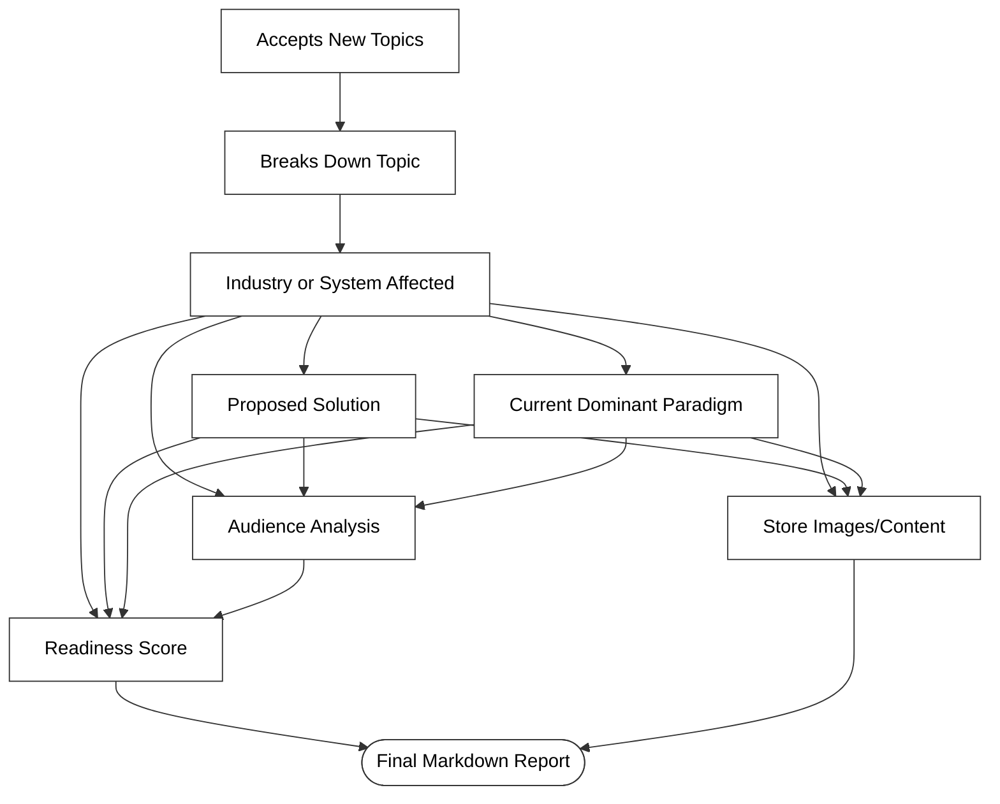
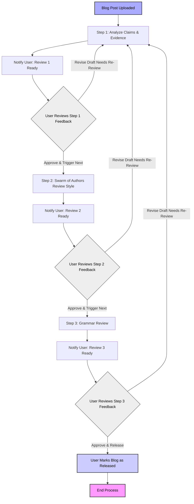

# Product Requirements Document: AI Blog Accelerator Agent

## 1. App Overview

**Goal:**
Accelerate the high-quality development of thoughtful blog content by automating research and layered review processes. Human authorship is preserved for ideation and writing.

**Summary:**
This application assists writers in two distinct phases:

* **Research Mode:** Breaks down a topic, gathers data, evaluates solutions, and produces comprehensive research documentation.
* **Review Mode:** Assesses a written blog post across factual correctness, writing clarity, and grammar, enabling structured iteration and improvement.

**Deployment Target:**

* Docker container
* Ubuntu-based Linux machine
* Access to OpenAI and/or Groq APIs for LLM capabilities
* MongoDB for persistent storage of user history, style references, and full content archives (markdown, images, post revisions)

---

## 2. User Flows

### Researcher Flow



### Reviewer Flow



---

## 3. Tech Stack and APIs

### Backend

* **Python** – [https://www.python.org/](https://www.python.org/)
* **FastAPI** – [https://fastapi.tiangolo.com/](https://fastapi.tiangolo.com/) (preferred)
* **LangChain** – [https://docs.langchain.com/](https://docs.langchain.com/)
* **MongoDB** – [https://www.mongodb.com/docs/](https://www.mongodb.com/docs/)
* **Docker** – [https://docs.docker.com/engine/](https://docs.docker.com/engine/)

### AI Services

* **OpenAI API (GPT-4 / Embeddings)** – [https://platform.openai.com/docs](https://platform.openai.com/docs)
* **Groq API (Mixtral/LLaMA)** – [https://groq.com/docs](https://groq.com/docs)
* **Cohere (Embeddings)** – [https://docs.cohere.com/docs](https://docs.cohere.com/docs)
* **Brave Search MCP API (Images + Web Results)** – [https://search.brave.com/help/api](https://search.brave.com/help/api)
* **Firecrawl MCP Server (Web Scraping & Visual Asset Retrieval)** – [https://firecrawl.dev](https://firecrawl.dev)

### Tools and Components

* **Sequential Reasoning:** LangGraph (preferred within LangChain)
* **Memory Store:** MongoDB with LangChain vector store wrappers
* **Content Storage:** MongoDB document store for markdown, images (as references or base64), and post revisions
* **Debugging/Monitoring:** Opik MCP server for logging, context visualization, and agent traceability – [https://opik.ai](https://opik.ai) (or internal fork)

### Notifications

* **SendGrid (Email Alerts)** – [https://docs.sendgrid.com/](https://docs.sendgrid.com/)
* **SMTP/IMAP** – Native or mail client integrations for low-dependency setups

### Docker Configuration

**Base Image:**

```Dockerfile
FROM python:3.11-slim
```

**Typical Layers:**

```Dockerfile
WORKDIR /app
COPY requirements.txt ./
RUN pip install --no-cache-dir -r requirements.txt
COPY . ./
CMD ["python", "main.py"]
```

**Dockerfile Recommendations:**

* Use multi-stage builds if using heavy NLP dependencies (e.g. for PDF/image parsing)
* Include `.env` support for secret keys and model API tokens
* Expose FastAPI on port 8080 or 8000
* Mount a shared `/logs` folder for easy inspection of logs (or pipe to Opik MCP)

**Docker Compose (Optional):**

* MongoDB service
* LLM agent gateway proxy (if needed)
* LangServe / Opik MCP dashboards

---

## 4. Core Features

### Research Mode

* Topic intake and validation
* Topic decomposition
* System and solution evaluation
* Dominant paradigm assessment
* Audience knowledge bridging
* Visual and multimedia scraping
* Readiness scoring

### Review Mode

* Claim identification and fact check
* Opinion vs. evidence mapping
* Reviewer personas (writing style feedback)
* Structured table output for disagreements
* Grammar check with reason classification
* Review progress tracking and triggering

---

## 5. In Scope vs Out of Scope

| Feature                    | In Scope                       | Out of Scope                   |
| -------------------------- | ------------------------------ | ------------------------------ |
| Research automation        | ✅                              | ❌                              |
| Multi-agent review         | ✅                              | ❌                              |
| Human authoring interface  | ❌                              | ✅ (writing happens externally) |
| Web UI                     | ❌ (CLI or minimal API assumed) | ✅                              |
| Notion webhook integration | ✅ (future milestone)           | ❌                              |
| Real-time feedback         | ❌ (asynchronous only)          | ✅                              |
| Image generation           | ❌ (image collection only)      | ✅                              |
| Grammar & style correction | ✅                              | ❌ (does not auto-rewrite text) |

---


## 6. Deployment

### Docker Compose Setup

```yaml
version: '3.9'

services:
  blog-agent:
    build: .
    container_name: blog-accelerator
    restart: always
    ports:
      - "8080:8080"
    environment:
      - OPENAI_API_KEY=${OPENAI_API_KEY}
      - GROQ_API_KEY=${GROQ_API_KEY}
      - MONGODB_URI=mongodb://mongo:27017
      - SENDGRID_API_KEY=${SENDGRID_API_KEY}
      - OPIK_SERVER=http://opik:7000
      - FIRECRAWL_SERVER=http://firecrawl:4000
    depends_on:
      - mongo
      - opik
      - firecrawl
    volumes:
      - ./logs:/app/logs
      - ./data:/app/data

  mongo:
    image: mongo:6.0
    container_name: mongo
    restart: always
    ports:
      - "27017:27017"
    volumes:
      - mongo_data:/data/db

  opik:
    image: opik/opik-mcp:latest
    container_name: opik
    restart: unless-stopped
    ports:
      - "7000:7000"

  firecrawl:
    image: firecrawl/firecrawl-mcp:latest
    container_name: firecrawl
    restart: unless-stopped
    ports:
      - "4000:4000"

volumes:
  mongo_data:
```

### Environment File (.env)

```env
# OpenAI
OPENAI_API_KEY=sk-xxxxxxxxxxxxxxxxxxxxxxxxxxxx

# Groq
GROQ_API_KEY=grq-xxxxxxxxxxxxxxxxxxxxxxxxxxxx

# MongoDB
MONGODB_URI=mongodb://mongo:27017

# SendGrid
SENDGRID_API_KEY=SG.xxxxxxxxxxxxxxxxxxxxxxxxxx

# Opik MCP
OPIK_SERVER=http://opik:7000

# Firecrawl MCP
FIRECRAWL_SERVER=http://firecrawl:4000

# FastAPI Env Mode
APP_ENV=development
```

---

## 7. Review Progress Management via YAML

### Purpose

To track and trigger transitions between review stages using a reliable, structured YAML file named `blog_title_review_tracker.yaml`, instead of freeform markdown.

### `blog_title_review_tracker.yaml` Example

```yaml
blog_title: "why-microgrids-will-replace-utilities"
current_version: 3

review_pipeline:
  factual_review:
    complete: true
    completed_by: "agent"
    result_file: "why-microgrids_review1.md"
    timestamp: 2024-05-02T20:31:00Z

  style_review:
    complete: false
    completed_by: null
    result_file: null
    timestamp: null

  grammar_review:
    complete: false
    completed_by: null
    result_file: null
    timestamp: null

final_release:
  complete: false
  released_by: null
  timestamp: null
```

### How It Works

1. The user **approves a stage** by setting `complete: true` on the next review section.
2. A background agent (watcher or polling script) parses the YAML file.
3. The agent **confirms prior stages are complete** before running the new stage.
4. If valid, the next review process is triggered, and the YAML is updated.

### Benefits

* Machine-parseable
* Easier to validate than markdown checkboxes
* Prevents accidental stage skipping or corruption

### Optional CLI Tool

To prevent YAML syntax errors, users can instead run:

```bash
./agent approve-review --stage style_review
```

This will update the file safely and trigger the correct action.

---
