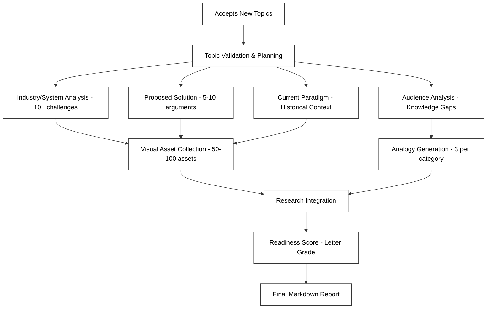
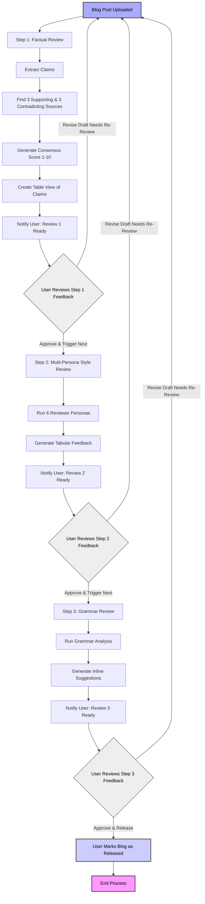

# Product Requirements Document: AI Blog Accelerator Agent

## 1. App Overview

**Goal:**
Accelerate the high-quality development of thoughtful blog content by automating deep research and multi-layered review processes. Human authorship is preserved for ideation and writing.

**Summary:**
This application assists writers in two distinct phases:

* **Research Mode:** Performs exhaustive topic breakdown (industry, solution, paradigm, audience), gathers extensive data with visual assets, evaluates solutions, and produces comprehensive research documentation.
* **Review Mode:** Conducts three-stage review process (factual verification with multiple sources, multi-persona style review, grammar correction) with user approval gates between stages.

**Target Audience:**
The Blog Accelerator Agent is designed for:
* STEM majors in later years of college
* Technical professionals of any age
* Engineers across all disciplines
* Founders and entrepreneurs
* Business professionals who need to understand technical topics

**Deployment Target:**

* Docker container
* Ubuntu-based Linux machine
* Access to OpenAI and/or Groq APIs for LLM capabilities
* MongoDB for persistent storage of complex research data, user history, style references, and full content archives (markdown, images, post revisions)
* Firecrawl MCP for visual asset collection
* Opik MCP for agent observability

---

## 2. User Flows

### Researcher Flow (Enhanced)



### Reviewer Flow (Enhanced)



---

## 3. Tech Stack and APIs

### Backend

* **Python** – [https://www.python.org/](https://www.python.org/)
* **FastAPI** – [https://fastapi.tiangolo.com/](https://fastapi.tiangolo.com/) (preferred)
* **LangChain** – [https://docs.langchain.com/](https://docs.langchain.com/)
* **MongoDB** – [https://www.mongodb.com/docs/](https://www.mongodb.com/docs/)
* **Docker** – [https://docs.docker.com/engine/](https://docs.docker.com/engine/)

### AI Services

* **OpenAI API (GPT-4 / Embeddings)** – [https://platform.openai.com/docs](https://platform.openai.com/docs)
* **Groq API (Mixtral/LLaMA)** – [https://groq.com/docs](https://groq.com/docs)
* **Cohere (Embeddings)** – [https://docs.cohere.com/docs](https://docs.cohere.com/docs)
* **Brave Search MCP API (Premium Tier)** – [https://search.brave.com/help/api](https://search.brave.com/help/api)
* **Firecrawl MCP Server (Web Scraping & Visual Asset Retrieval)** – [https://firecrawl.dev](https://firecrawl.dev)
* **Academic APIs** – For authoritative source validation

### Tools and Components

* **Sequential Reasoning:** LangGraph (preferred within LangChain)
* **Memory Store:** MongoDB with LangChain vector store wrappers
* **Content Storage:** Enhanced MongoDB schema for complex research data, media assets, and version control
* **Debugging/Monitoring:** Opik MCP server for logging, context visualization, and agent traceability – [https://opik.ai](https://opik.ai)

### Notifications

* **SendGrid (Email Alerts)** – [https://docs.sendgrid.com/](https://docs.sendgrid.com/)
* **SMTP/IMAP** – Native or mail client integrations for low-dependency setups

### Docker Configuration

**Base Image:**

```Dockerfile
FROM python:3.11-slim
```

**Typical Layers:**

```Dockerfile
WORKDIR /app
COPY requirements.txt ./
RUN pip install --no-cache-dir -r requirements.txt
COPY . ./
CMD ["python", "main.py"]
```

**Dockerfile Recommendations:**

* Use multi-stage builds for heavy NLP dependencies
* Include `.env` support for API tokens with expanded API keys for research depth
* Expose FastAPI on port 8080
* Mount shared folders for logs and content storage

**Docker Compose:**

* MongoDB service
* Firecrawl MCP (for visual asset gathering)
* Opik MCP (for agent tracing and debugging)

---

## 4. Core Features

### Research Mode (Enhanced)

* Topic intake and validation
* Hierarchical topic decomposition
* **Sequential thinking methodology** for deeper analysis with nuance
* Industry analysis (10+ critical challenges with sources)
* Solution evaluation (5-10 pro arguments, 5-10 counter arguments)
* Current paradigm assessment (historical context, 2-3 alternatives)
* Audience knowledge mapping (glossary, knowledge gaps)
* Visual asset collection (50-100 relevant visuals)
* Analogy generation (3 per category)
* Readiness scoring (letter grade A-F)

### Research Mode Features

*   Exhaustive topic breakdown:
    *   Industry/System Analysis (Challenges, Components, Sources)
        *   **Enhanced depth:** Analysis includes reflection on core constraints and nuances (e.g., team size, resource limits) before identifying challenges or evaluating components.
        *   **Sequential thinking:** First identifying constraints, then systemic context, then stakeholder perspectives before challenge identification.
    *   Solution Analysis (Pros, Cons, Metrics, Sources)
        *   **Sequential approach:** Considers implementation complexity and adoption barriers before evaluating effectiveness.
    *   Paradigm Analysis (Historical Shifts, Lessons, Future Projections, Sources)
        *   **Sequential analysis:** Examines paradigm evolution and historical context before assessing effectiveness.
    *   Audience Analysis (Segments, Needs, Knowledge, Strategies)
*   Extensive data gathering with authoritative sources
*   Visual asset collection (related images, videos, infographics)
*   Analogy generation and evaluation
*   Comprehensive research documentation output

### Review Mode (Enhanced)

* Three-stage review process with user approval gates
* **Factual Review:**
  * Claim identification and extraction
  * 3 supporting + 3 contradicting sources per claim
  * Consensus scoring (1-10 scale)
  * Tabular claim assessment
* **Style Review:**
  * 6 distinct reviewer personas:
    * Packy Mckormic
    * Edward Tufte
    * Casey Handmer
    * Paul Graham
    * Naval
    * Xavier Dedenbach
  * Persona-based writing style assessment
  * Structured table with critique categories
* **Grammar Review:**
  * Comprehensive grammar check
  * Inline suggestion format
  * Categorized fixes (confidence, clarity, grammar)

### Research Report Web Viewer

* **Auto-opening browser view** of research results
* Clean, responsive UI for reading comprehensive research reports
* Collapsible sections for easy navigation of lengthy content
* Visual indicators for readiness scores
* Embedded media viewer for visual assets
* Search and filter capabilities for large reports
* Shareable URLs for team collaboration

This feature enhances usability by automatically opening completed research in a browser tab for immediate review, rather than requiring users to navigate MongoDB directly.

---

## 5. In Scope vs Out of Scope

| Feature                     | In Scope                       | Out of Scope                    |
|---------------------------- | ------------------------------ | ------------------------------- |
| Deep research automation    | ✅                              | ❌                              |
| Multi-persona review        | ✅                              | ❌                              |
| Visual asset collection     | ✅                              | ❌                              |
| Analogy generation          | ✅                              | ❌                              |
| Human authoring interface   | ❌                              | ✅ (writing happens externally) |
| Web UI                      | ❌ (CLI or minimal API assumed) | ✅                              |
| Notion webhook integration  | ✅ (future milestone)           | ❌                              |
| Real-time feedback          | ❌ (asynchronous only)          | ✅                              |
| Image generation            | ❌ (image collection only)      | ✅                              |
| Grammar & style correction  | ✅                              | ❌ (does not auto-rewrite text) |

---


## 6. Deployment

### Docker Compose Setup

```yaml
version: '3.9'

services:
  blog-agent:
    build: .
    container_name: blog-accelerator
    restart: always
    ports:
      - "8080:8080"
    environment:
      - OPENAI_API_KEY=${OPENAI_API_KEY}
      - GROQ_API_KEY=${GROQ_API_KEY}
      - MONGODB_URI=mongodb://mongo:27017
      - SENDGRID_API_KEY=${SENDGRID_API_KEY}
      - OPIK_SERVER=http://opik:7000
      - FIRECRAWL_SERVER=http://firecrawl:4000
      - BRAVE_API_KEY=${BRAVE_API_KEY}
    depends_on:
      - mongo
      - opik
      - firecrawl
    volumes:
      - ./logs:/app/logs
      - ./data:/app/data

  mongo:
    image: mongo:6.0
    container_name: mongo
    restart: always
    ports:
      - "27017:27017"
    volumes:
      - mongo_data:/data/db

  opik:
    image: opik/opik-mcp:latest
    container_name: opik
    restart: unless-stopped
    ports:
      - "7000:7000"

  firecrawl:
    image: firecrawl/firecrawl-mcp:latest
    container_name: firecrawl
    restart: unless-stopped
    ports:
      - "4000:4000"

volumes:
  mongo_data:
```

### Environment File (.env)

```env
# OpenAI
OPENAI_API_KEY=sk-xxxxxxxxxxxxxxxxxxxxxxxxxxxx

# Groq
GROQ_API_KEY=grq-xxxxxxxxxxxxxxxxxxxxxxxxxxxx

# MongoDB
MONGODB_URI=mongodb://mongo:27017

# Brave Search (Premium Tier)
BRAVE_API_KEY=brv-xxxxxxxxxxxxxxxxxxxxxxxxxxxx

# SendGrid
SENDGRID_API_KEY=SG.xxxxxxxxxxxxxxxxxxxxxxxxxx

# Opik MCP
OPIK_SERVER=http://opik:7000

# Firecrawl MCP
FIRECRAWL_SERVER=http://firecrawl:4000

# FastAPI Env Mode
APP_ENV=development
```

---

## 7. Review Progress Management via YAML

### Purpose

Track and trigger transitions between review stages using a structured YAML file.

### Enhanced YAML Structure

```yaml
blog_title: "why-microgrids-will-replace-utilities"
current_version: 3

research_data:
  industry_analysis:
    challenges_count: 12
    sources_count: 24
  proposed_solution:
    pro_arguments_count: 8
    counter_arguments_count: 6
    metrics_count: 7
    visual_assets_count: 67
  current_paradigm:
    origin_year: 1982
    alternatives_count: 3
  audience_analysis:
    knowledge_gaps_count: 5
    acronyms_count: 14
    analogies_count: 6

review_pipeline:
  factual_review:
    complete: true
    completed_by: "agent"
    result_file: "why-microgrids_review1.md"
    timestamp: 2024-05-02T20:31:00Z
    claims_analyzed: 24
    avg_consensus_score: 7.3

  style_review:
    complete: false
    completed_by: null
    result_file: null
    timestamp: null
    personas_used: []

  grammar_review:
    complete: false
    completed_by: null
    result_file: null
    timestamp: null
    issues_identified: 0

final_release:
  complete: false
  released_by: null
  timestamp: null
```

### How It Works

1. Research data is recorded in the YAML to track research depth
2. User **approves a stage** by setting `complete: true` on the next review section
3. Agent validates stage transitions and enforces completion order
4. Statistical data is tracked for each stage

### CLI Tool

To prevent YAML syntax errors, users can run:

```bash
./agent approve-review --stage style_review
```

---

## 8. Data Model (MongoDB)

### Enhanced Schema for Research Depth

#### Blog Document:
```json
{
  "title": "string",
  "current_version": "number",
  "versions": [
    {
      "version": "number",
      "content": "string",
      "research": {
        "industry_analysis": [
          {
            "challenge": "string",
            "details": "string",
            "sources": ["array of source objects"]
          }
        ],
        "proposed_solution": {
          "pro_arguments": ["array of argument objects"],
          "counter_arguments": ["array of argument objects"],
          "metrics": ["array of metric objects"]
        },
        "current_paradigm": {
          "origin_date": "date",
          "previous_paradigm": "object",
          "arguments": ["array of argument objects"],
          "alternatives": ["array of alternative objects"]
        },
        "audience_analysis": {
          "knowledge_gaps": ["array of gap objects"],
          "acronyms": ["array of acronym objects"],
          "analogies": {
            "challenges": ["array of analogy objects"],
            "solutions": ["array of analogy objects"]
          }
        }
      },
      "review_status": {
        "factual": {
          "complete": "boolean",
          "claims": [
            {
              "text": "string",
              "line_numbers": "array of numbers",
              "supporting_evidence": ["array of source objects"],
              "contradicting_evidence": ["array of source objects"],
              "consensus_score": "number (1-10)"
            }
          ]
        },
        "style": {
          "complete": "boolean",
          "reviews": [
            {
              "persona": "string",
              "section": "string",
              "disagreement_type": "string",
              "point": "string",
              "severity": "string"
            }
          ]
        },
        "grammar": {
          "complete": "boolean",
          "suggestions": ["array of suggestion objects"]
        }
      }
    }
  ]
}
```

#### Media Asset Document:
```json
{
  "blog_title": "string",
  "version": "number",
  "category": "string (industry/solution/paradigm)",
  "type": "string (photo/video/infographic)",
  "source": "string",
  "url": "string",
  "alt_text": "string",
  "stored_base64": "string"
}
```

#### Persona Model Document:
```json
{
  "name": "string",
  "writing_samples": ["array of text samples"],
  "style_preferences": {
    "sentence_length": "string",
    "vocabulary_complexity": "string",
    "structural_preferences": "string",
    "tone": "string"
  }
}
```

---
