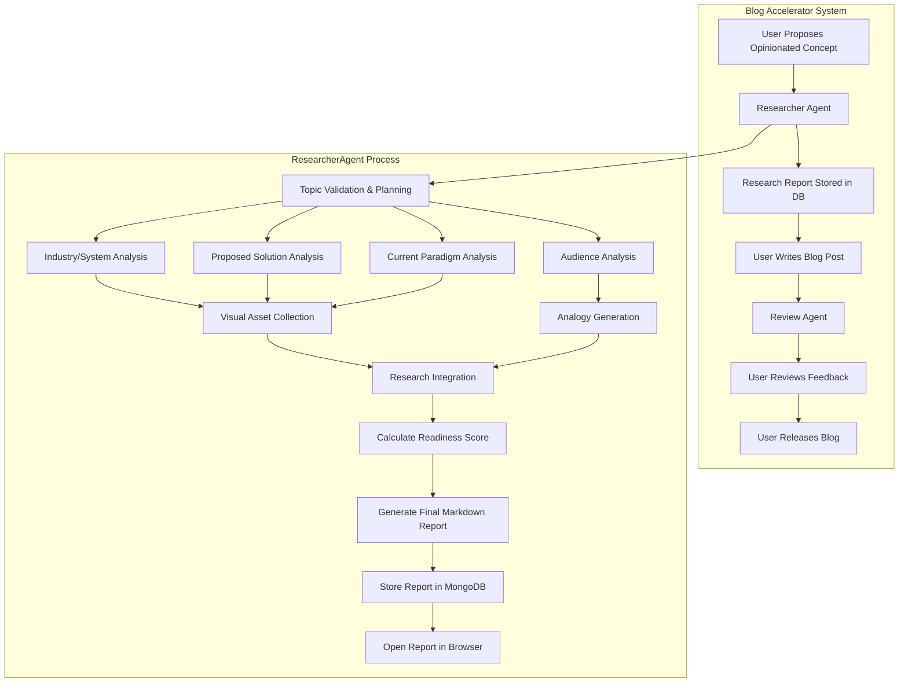
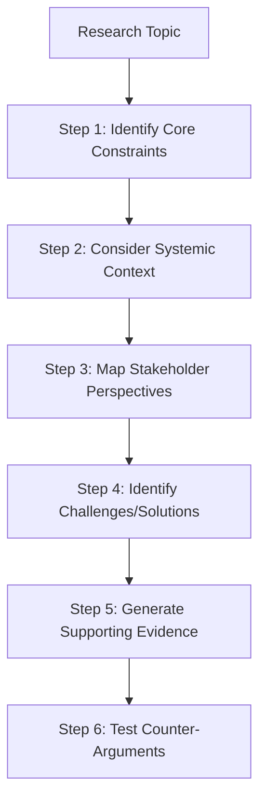
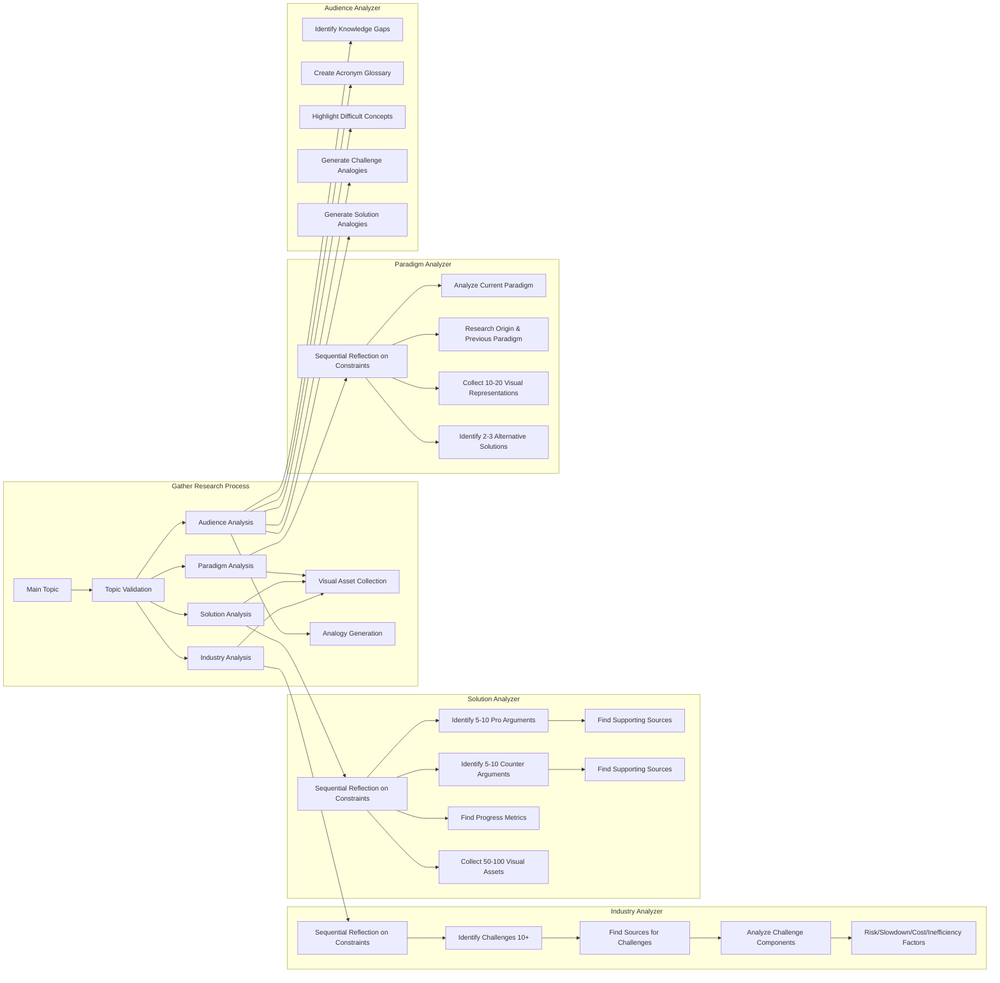
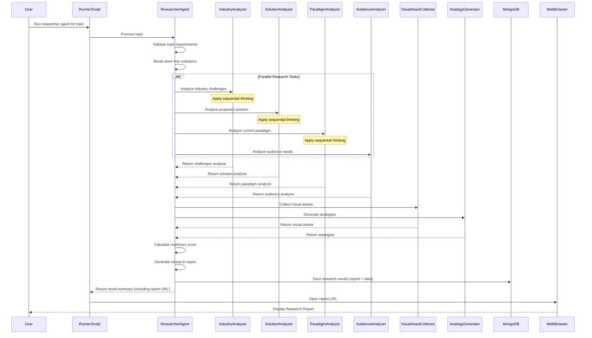

# Researcher Agent Architecture

## System Overview

The Researcher Agent is a sophisticated component of the Blog Accelerator that analyzes blog content and generates comprehensive research to enhance the quality and credibility of the blog. Below are diagrams illustrating its architecture and workflow.

## Research Methodology

The Researcher Agent implements **sequential thinking** to achieve deeper analysis with more nuance. This methodical approach ensures thorough consideration of all factors before drawing conclusions.

This sequential approach is applied to each research component (Industry, Solution, Paradigm) to ensure all analysis is contextually rich and considers multiple perspectives before reaching conclusions.

## Research Gathering Architecture

## Key Components

### 1. ResearcherAgent
Core class that orchestrates the research process. It initializes with various API keys and components:
- Source Validator: Validates and finds sources for claims
- FirecrawlClient: Client for web search and crawling
- Various analyzers: For industry, solution, paradigm, audience analysis, and analogy generation

### 2. Industry Analyzer
Identifies challenges facing industries or systems related to the blog topic:
- **Employs sequential thinking** to first understand core constraints and nuances before identifying challenges
- Reflects on team size, resource limitations, and contextual factors
- Identifies critical challenges (minimum 10)
- Finds supporting sources for each challenge
- Analyzes components of each challenge (risk factors, slowdown factors, cost factors, inefficiency factors)

### 3. Solution Analyzer
Analyzes proposed solutions discussed in the blog:
- **Employs sequential thinking** to understand solution constraints before evaluating effectiveness
- Considers implementation complexity, adoption barriers, and ecosystem dependencies
- Identifies 5-10 pro arguments supporting the solution
- Identifies 5-10 counter arguments against the solution
- Finds key data showing progress with 5-10 metrics
- Collects 50-100 visual assets representing the solution
- Finds supporting sources for all arguments

### 4. Paradigm Analyzer
Analyzes current and historical paradigms related to the topic:
- **Employs sequential thinking** to understand paradigm evolution before assessing effectiveness
- Considers historical context, driving forces, and shifting constraints
- Identifies 5-10 reasons the current paradigm addresses challenges
- Determines when this paradigm was created
- Researches the previous paradigm 
- Collects 10-20 visual representations
- Identifies 2-3 other emerging solutions and their shortcomings

### 5. Audience Analyzer
Analyzes the target audience for the blog:
- Identifies knowledge gaps between research and general audience
- Creates glossary of acronyms with explanations
- Highlights concepts difficult for the audience to understand
- Generates 3 analogies to explain challenges
- Generates 3 analogies to explain proposed solutions

### 6. Visual Asset Collection
Gathers visual materials to support the blog:
- Collects images, videos, infographics related to all aspects
- Stores assets in organized folders by topic
- Ensures variety of visual material types

## Sequential Thinking Implementation

The agent implements sequential thinking through:

1. **Prompt Engineering**: Each analysis prompt requires the LLM to first consider constraints and context before generating output
2. **Multi-Step Reasoning**: Breaking down complex analyses into sequential steps
3. **Constraint Mapping**: Explicitly identifying limitations before evaluating solutions
4. **Perspective Shifting**: Analyzing topics from multiple stakeholder viewpoints sequentially
5. **Chain-of-Thought**: Using structured reasoning to build nuanced understanding

This approach ensures that research output has greater depth and considers more nuance than a single-pass analysis.

## Data Flow

## Readiness Score Calculation

The readiness score (A-F) is calculated based on:
- Completeness of industry challenge analysis (10+ challenges)
- Quality of solution arguments (5-10 pro and counter arguments)
- Thoroughness of paradigm analysis
- Depth of audience analysis
- Number of visual assets (50-100 for solution, 10-20 for paradigm)
- Number of analogies (3 for challenges, 3 for solutions)
- Quality and authority of sources

A higher score indicates a more thorough research foundation for the blog post. 